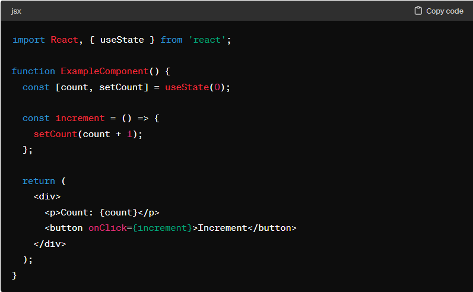
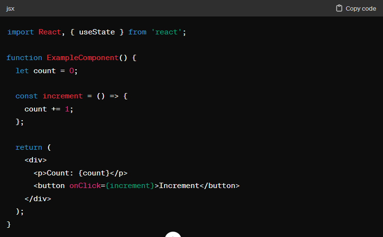

# firebase モジュール

firebase と react を紐づけるためのモジュール

# react-router-dom モジュール

react でルーティングが簡単に行えるようになる

# 再レンダリングとリロードの違い

React における「リロード」と「再レンダリング」は、異なる概念です。

リロード (Reload):
リロードは、通常、ブラウザがページ全体を再読み込みすることを指します。これは、ユーザーがページを再読み込みしたり、ページが新しいデータやコードで更新された場合に発生します。
リロードは、React アプリケーションのすべての状態やコンポーネントをリセットします。ページ全体が再構築され、React アプリケーションの JavaScript コードが再実行されます。
再レンダリング (Rerender):
再レンダリングは、React コンポーネントがその状態やプロパティの変更に応じて UI を再描画するプロセスです。
React の仮想 DOM は、コンポーネントの状態やプロパティの変更を検出し、変更が必要な部分のみを再レンダリングします。これにより、効率的な UI の更新が可能になります。
再レンダリングは、React が自動的に管理するものであり、通常はブラウザのリロードなしに行われます。これにより、ユーザーエクスペリエンスが向上し、ページの再読み込みの必要がなくなります。
簡潔に言えば、リロードはブラウザがページ全体を再読み込みする行為であり、再レンダリングは React がコンポーネントの一部を再描画するプロセスです。

## setState と通常の変数代入との違い

React の useState フックを使用してステートを更新する方法と、直接変数に代入する方法の主な違いは、更新が反映される方法と React の再描画に関係します。

useState フックを使用してステートを更新する場合、新しいステートの値を反映させるために setCount 関数を使用します。この方法は、React によって更新が検出され、コンポーネントが再描画されます。React は、新しいステートが直接変数に代入されるのではなく、setCount 経由で更新されたことを把握し、再描画をトリガーします。

直接変数に代入してステートを更新する場合、React はステートの変更を検出できません。したがって、変数が更新されても、React は再描画をトリガーしません。そのため、画面上の表示は更新されません。
直接変数に代入すると、React がステートの変更を検出できないため、再描画が行われません。そのため、React のルールに従ってステートを更新する必要があります。useState フックを使用してステートを更新する場合は、React が更新を検出し、コンポーネントが再描画されます。

## Firebase のデータ構造（コレクション,ドキュメント,データ）

## useNavigate フックと windows.location.href のリダイレクトの違い

useNavigate と window.location.href は、React アプリケーション内で異なる方法でページの遷移を処理するためのツールです。

useNavigate:
useNavigate は React Router v6 から導入されたフックです。
React Router v6 では、<Link>コンポーネントから直接アクセスできない場合やプログラム的にページ遷移を行いたい場合に使用されます。
フックとして提供され、React コンポーネント内で使用されます。
使用法は非常にシンプルで、例えば、const navigate = useNavigate(); navigate('/path');のように使用します。

window.location.href:
window.location.href は、ブラウザの JavaScript API で提供されるプロパティで、現在のページの URL を表します。
ページのリダイレクトを行うために使用されます。
直接ブラウザのウィンドウを操作するため、React Router とは独立しています。
ページのリダイレクトを行うために、window.location.href = '/path';のように使用します。
基本的な違いは、useNavigate は React Router に依存しており、React コンポーネント内でのページ遷移をサポートする一方で、window.location.href はブラウザの API であり、リダイレクトを行うために使用されます。そのため、React Router を使用していない場合や、React コンポーネントの外部でページ遷移を行いたい場合には、window.location.href を使用することが一般的です。
